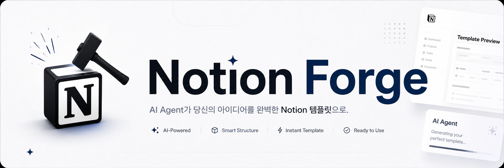

<p align="center">
  
</p>

# NotionForge

<p align="center">
  <a href="https://github.com/JaylenAI/Notion_Forge/actions/workflows/ci.yml"></a>
  <a href="https://github.com/JaylenAI/Notion_Forge/blob/main/LICENSE"></a>
  <a href="https://www.python.org/downloads/"></a>
  <a href="https://notion.so"></a>
  <a href="https://docs.docker.com/"></a>
</p>

<p align="center">
  <b>AI agent that auto-generates professional Notion workspaces from a single natural-language prompt.</b>
</p>

<p align="center">
  <a href="README.ko.md">한국어</a> &bull;
  <a href="#quickstart">Quick Start</a> &bull;
  <a href="#features">Features</a> &bull;
  <a href="#architecture">Architecture</a> &bull;
  <a href="#skills">Skill System</a> &bull;
  <a href="docs/">Docs</a> &bull;
  <a href="CONTRIBUTING.md">Contributing</a>
</p>

---

Just say **"Build me a CRM dashboard"** — the AI designs databases, arranges 10 view types, wires Relations/Formulas/Rollups, lays out dashboard widgets, and fills in sample data. Supports 5 AI providers and leverages nearly every feature of the Notion API 2026-03-11.

<table>
<tr><td><b>Plan-Execute-Reflect Agent</b></td><td>Autonomous agent loop: AI selects tools, executes them, and self-validates — up to 3 re-plans for optimal results.</td></tr>
<tr><td><b>11 Tools + 48 Skills</b></td><td>Tool Registry with LLM function calling. 12 Tier-1 + 36 Tier-2 domain-specific skills generate the perfect template for any request.</td></tr>
<tr><td><b>5 AI Providers</b></td><td>Copilot SDK (GPT-4.1, free) / Claude / Gemini / Groq / OpenAI — Strategy Pattern auto-detects whichever API key you set.</td></tr>
<tr><td><b>10 View Types + Dashboards</b></td><td>Table, Board, Calendar, Timeline, Gallery, List, Chart, Form, Dashboard, Pivot — auto-placed widgets with filter/sort bindings.</td></tr>
<tr><td><b>Notion Workers Integration</b></td><td>Auto-scaffold and deploy Sync/Tool/Webhook TypeScript workers. Register AI natively via External Agents API.</td></tr>
<tr><td><b>Real-time Chat UI</b></td><td>React 19 + WebSocket streaming shows every creation step live. Multi-turn conversations for iterative refinement.</td></tr>
<tr><td><b>Blueprint Auto-Correction</b></td><td>Gen-Eval structural validation (up to 3 rounds) + 13 PostProcessor auto-fixes. Automatic rollback on failure.</td></tr>
<tr><td><b>Security Built-in</b></td><td>Input Guardrail (prompt injection defense), Rate Limiting, CSRF protection, OAuth integration, error sanitization.</td></tr>
</table>

---

<h2 id="quickstart">Quick Start</h2>

### Prerequisites

| Tool | Minimum Version | Check |
|------|----------------|-------|
| Python | 3.11+ | `python --version` |
| [uv](https://docs.astral.sh/uv/) | latest | `uv --version` |
| Node.js | 20+ | `node --version` |
| Docker (optional) | 24+ | `docker --version` |

### 1. Clone & Configure

```bash
git clone https://github.com/JaylenAI/Notion_Forge.git
cd Notion_Forge
cp .env.example .env
```

### 2. Set Up `.env`

```env
# Required (just these two)
NOTION_API_KEY=ntn_xxxxxxxxxxxx       # https://notion.so/my-integrations
NOTION_PARENT_PAGE_ID=xxxxx           # Parent page ID where templates are created

# AI Provider — set any one and it auto-detects (priority: Copilot > Claude > Gemini > Groq)
COPILOT_ENABLED=true                  # Free with GitHub Copilot subscription
ANTHROPIC_API_KEY=                    # Claude (paid, highest quality)
GEMINI_API_KEY=                       # Gemini (free, 20 req/day)
GROQ_API_KEY=                         # Groq (free, fast)
```

### 3. Run

**Docker (recommended)**
```bash
docker compose up --build
```

**Local (uv + npm)**
```bash
# Terminal 1: Backend
cd backend && uv sync && uv run uvicorn app.main:app --port 9500 --reload

# Terminal 2: Frontend
cd frontend && npm install && npm run dev
```

### 4. Access

| Service | URL |
|---------|-----|
| Chat UI | http://localhost:9501 |
| API Docs (Swagger) | http://localhost:9500/docs |
| Backend API | http://localhost:9500 |

> **Security Notice**: NotionForge is a **local-only** self-hosted tool. The API has no built-in authentication — do not expose it directly to the public internet. If external access is needed, add an authentication layer via a reverse proxy (e.g., nginx).

---

<h2 id="features">Features</h2>

### AI Agent

| Feature | Description |
|---------|-------------|
| Plan-Execute-Reflect Loop | AI autonomously selects tools, executes, and validates — up to 3 re-plans |
| Tool Registry (11 tools) | create_page, create_database, add_blocks, create_columns, add_database_items, link_databases, create_view, create_worker, register_external_agent, apply_color_theme, generate_cover |
| Hybrid SkillRouter | Keyword fast-path (score >= 2) + LLM precise classification |
| Episodic Memory | Learns success/failure patterns + remembers user preferences |
| Provider Strategy | 5 providers with auto-detection + Fallback Chain + Circuit Breaker |
| Input Guardrail | Prompt injection defense + input validation |
| Approval Gate | User confirmation before creation begins |

### Full Notion API Coverage (2026-03-11)

| Area | Scope |
|------|-------|
| 30+ Block Types | heading, callout, toggle, quote, code, table, equation, tab, synced_block, button, etc. |
| Inline Formatting | bold, italic, underline, strikethrough, code, link, color, mentions |
| Media | image, video, audio, file, pdf, bookmark, embed (Figma, GitHub, Loom + 12 more) |
| 10 DB View Types | table, gallery, calendar, board, timeline, list, chart, form, dashboard, pivot |
| All DB Properties | select, multi_select, status, relation, rollup, formula, unique_id, people, etc. |
| Advanced Filters | relative dates, multi-value, "me" filter, compound AND/OR conditions |
| Dashboards | chart/number/list/filter-view widgets with auto-layout |
| Workers | Sync/Tool/Webhook TypeScript worker scaffolding + deployment |
| External Agents | Native AI agent registration in Notion |
| Comments | Block/thread comment CRUD |
| File Upload | Server-to-Notion direct file upload |
| CLI Integration | `ntn` CLI Python wrapper (api, deploy, dev, logs) |

### Frontend

| Feature | Description |
|---------|-------------|
| Real-time Streaming | WebSocket shows creation steps live |
| Dark / Light Theme | Full CSS-variable theme system |
| 5 Pages | Dashboard, Library, Integrations, Profile, Support |
| Notion-style Preview | 14 block types + 4 DB view renderers |
| Prompt Library | 4 categories x 18 prompt templates |
| Mobile Responsive | Tab-based UI below 768px |
| Multi-turn Editing | "Add a property", "Change the view" via natural language |
| i18n | Korean / English / Japanese |

---

<h2 id="architecture">Architecture</h2>

```
User Input
  |
  +-- [0] Input Guardrail ------- Prompt injection defense + input validation
  |
  +-- [1] Intent Analyzer ------- Intent classification (CREATE / MODIFY / QUESTION)
  |
  +-- [2] Skill Router ---------- Best match from 48 skills (keyword + LLM)
  |
  +-- [3] Episodic Memory ------- Past success/failure patterns + user preferences
  |
  +-- [4] Layout Router --------- Auto-select from 8 layout patterns
  |
  +-- [5] Prompt Assembler ------ Dynamic .md assembly (base + mode + layout + views)
  |
  +-- [6] AI Generation --------- Provider Strategy (Copilot/Claude/Gemini/Groq/OpenAI)
  |
  +-- [7] Gen-Eval Loop --------- Structural validation -> feedback -> regeneration (max 3)
  |
  +-- [8] Post-Processor -------- 13 auto-corrections (callout, status, spacing, i18n, etc.)
  |
  +-- [9] Approval Gate --------- User confirmation / cancel
  |
  +-- [10] Agent Loop ----------- Plan-Execute-Reflect (11-tool Tool Registry)
  |
  +-- [11] 5-Pass Creation ------ Page -> Subpages -> DB(legacy) -> Views(latest) -> Sample data
  |
  +-- [12] Rollback ------------- Auto-delete on failure
```

### Layout Patterns

| Layout | Use Case | Default View |
|--------|----------|-------------|
| `simple_tracker` | Habit / fitness / sleep tracker | table |
| `gallery_hero` | Journal / reading / recipe collection | gallery |
| `kanban_board` | Project / task / sprint management | board |
| `calendar_main` | Schedule / content calendar | calendar |
| `dashboard_widgets` | CRM / dashboard / KPI | board + chart |
| `category_hub` | Onboarding / wiki / guide | toggles |
| `portfolio` | Portfolio / resume | gallery + timeline |
| `sidebar_main` | General purpose (default) | table |

---

<h2 id="skills">Skill System (48 Skills)</h2>

### Tier 1 — General Categories (12)

| Skill | Use Case | Default Views |
|-------|----------|--------------|
| `track` | Habits / fitness / study tracking | calendar, table |
| `collect` | Collections (books, movies, restaurants) | gallery, table |
| `manage` | Project / task management | board, timeline |
| `plan` | Planning (travel, wedding, goals) | calendar, table |
| `organize` | Information organizing (bookmarks, contacts) | table, list |
| `guide` | Guides / onboarding / manuals | table, board |
| `hub` | Dashboard / team home | calendar, board |
| `finance` | Budget / investment / expense tracking | table, calendar |
| `journal` | Diary / retrospective / gratitude | gallery, calendar |
| `content` | Content calendar / social media | board, calendar |
| `learn` | Study / exam / language learning | table, board |
| `crm` | Customer relations / sales | board, timeline |

### Tier 2 — Domain-Specific (36)

| Category | Skills | Use Cases |
|----------|--------|-----------|
| track | fitness, habit, health, diet | Workout / habits / health / nutrition |
| collect | reading, recipe, movie, music, cafe | Books / recipes / movies / music / cafes |
| manage | project, sprint, bug, meeting | Projects / sprints / bugs / meeting notes |
| plan | travel, wedding, goals | Travel / wedding / OKR goals |
| organize | bookmark, inventory, contact | Bookmarks / inventory / contacts |
| guide | onboarding, wiki, sop | Onboarding / wiki / SOPs |
| hub | team_home, life_os | Team home / life OS |
| finance | budget, investment, subscription | Budget / investment / subscriptions |
| journal | diary, gratitude, review | Diary / gratitude journal / retrospective |
| content | blog, youtube, social | Blog / YouTube / social media |
| learn | study, language | Study planner / language learning |
| crm | sales | Sales pipeline |

> Adding a new skill: just create a directory + `SKILL.md` pattern file under `app/skills/`.
> Full guide: [docs/SKILL_GUIDE.md](docs/SKILL_GUIDE.md)

---

## Tech Stack

| Layer | Technology |
|-------|-----------|
| **Backend** | Python 3.11+ / FastAPI / uv |
| **AI** | Copilot SDK (GPT-4.1) / Claude / Gemini / Groq / OpenAI — Strategy Pattern |
| **Notion** | notion-client 2.x + httpx (Dual API: write 2022-06-28 / read+views 2026-03-11) |
| **Frontend** | React 19 / TypeScript 5.7 / Vite 7 / Zustand 5 / TailwindCSS 4 |
| **Testing** | pytest (1,414 tests, 80%+ coverage) + live Notion QA harness |
| **CI/CD** | GitHub Actions (lint -> test -> typecheck -> docker -> security scan) |
| **Deployment** | Docker Compose (multi-stage build) |

---

## Project Structure

```
NotionForge/
├── backend/
│   ├── app/
│   │   ├── main.py                   # FastAPI entrypoint
│   │   ├── config.py                 # Provider auto-detection
│   │   ├── agent/                    # AI Agent core
│   │   │   ├── orchestrator.py       # Real-time streaming pipeline
│   │   │   ├── agent_loop.py         # Plan-Execute-Reflect
│   │   │   ├── creation_executor.py  # 5-Pass Notion creation
│   │   │   ├── providers/            # LLM Provider Strategy (5 providers)
│   │   │   ├── tools/                # Tool Registry (11 tools)
│   │   │   └── prompts/              # Modular prompts (.md)
│   │   ├── skills/                   # 48 domain skills
│   │   ├── notion/                   # Notion API client (Mixin pattern)
│   │   │   ├── client.py             # NotionClient (unified)
│   │   │   ├── page_ops.py           # Page CRUD
│   │   │   ├── database_ops.py       # Database CRUD + advanced filters
│   │   │   ├── block_ops.py          # Block CRUD
│   │   │   ├── view_ops.py           # 10 view types + dashboard/form
│   │   │   ├── workers.py            # Workers API + External Agents
│   │   │   ├── worker_builder.py     # TypeScript worker scaffold
│   │   │   ├── filter_builder.py     # Advanced filter builder
│   │   │   ├── widget_builder.py     # Dashboard widget builder
│   │   │   └── cli.py                # Notion CLI wrapper
│   │   ├── routers/                  # FastAPI routers (8)
│   │   ├── core/                     # Middleware, logging, metrics
│   │   └── schemas/                  # Pydantic models
│   └── tests/                        # 1,414 tests
│       └── unit/                     # Unit tests (58+ files)
├── frontend/
│   └── src/
│       ├── components/               # React components
│       ├── stores/                   # Zustand state management
│       ├── hooks/                    # Custom hooks
│       └── types/                    # TypeScript types
├── docs/                             # Documentation
│   ├── ARCHITECTURE.md               # System design
│   ├── API.md                        # REST/WebSocket API reference
│   ├── CHANGELOG.md                  # Changelog
│   ├── SKILL_GUIDE.md                # Skill authoring guide
│   └── ...
├── .github/
│   ├── workflows/ci.yml              # CI pipeline
│   └── ISSUE_TEMPLATE/               # Issue templates
├── docker-compose.yml                # Deployment config
├── .env.example                      # Environment variable template
├── CONTRIBUTING.md                   # Contributing guide
├── SECURITY.md                       # Security policy
└── LICENSE                           # MIT
```

---

## Cost

| Item | Cost |
|------|------|
| Notion API | Free |
| Copilot SDK (GPT-4.1, default) | Free (requires GitHub Copilot subscription) |
| Gemini API | Free (20 req/day) |
| Groq API | Free |
| Docker / uv / Vite | Free |
| **Total** | **$0** (with Copilot subscription) |

---

## Documentation

| Document | Description |
|----------|-------------|
| [Architecture](docs/ARCHITECTURE.md) | System design + Mermaid diagrams |
| [API Reference](docs/API.md) | REST / WebSocket endpoints |
| [Changelog](docs/CHANGELOG.md) | Version history |
| [Skill Guide](docs/SKILL_GUIDE.md) | How to write custom skills |
| [Block Support](docs/BLOCK_SUPPORT.md) | Block/property support matrix |
| [Deployment](docs/DEPLOYMENT.md) | Docker / production deployment |
| [Current Status](docs/CURRENT_STATUS.md) | Module-level progress |
| [Roadmap](docs/ROADMAP.md) | Future development |
| [Agent Design](docs/AGENT_DESIGN.md) | AI agent internals |
| [Test Guide](docs/TEST_GUIDE.md) | Testing strategy + coverage |

---

## Contributing

Contributions are welcome! See [CONTRIBUTING.md](CONTRIBUTING.md) for details.

```bash
# Dev setup
git clone https://github.com/JaylenAI/Notion_Forge.git
cd Notion_Forge

# Backend
cd backend && uv sync
uv run pytest tests/ -v              # Run tests
uv run ruff check . && uv run ruff format .  # Lint + format

# Frontend
cd ../frontend && npm install
npm run dev
```

### Extension Points

| Extension | How |
|-----------|-----|
| New AI Provider | Implement `BaseProvider` in `app/agent/providers/` -> register in `router.py` |
| New Tool | Implement `BaseTool` in `app/agent/tools/` -> register in `registry.py` |
| New Skill | Create directory + `SKILL.md` pattern file in `app/skills/` |
| New Block Type | Add builder function to `app/notion/block_builder.py` |
| New View Type | Add view creation method to `app/notion/view_ops.py` |

---

## Notes & Limitations

- **AI output is non-deterministic.** The same prompt won't produce byte-identical templates each time. NotionForge guarantees *structural* quality (required blocks, valid DBs, rollup/formula wiring) via golden examples + validation, not pixel-identical reproduction.
- **Single worker only.** Task store, OAuth state, rate-limit counters, and metrics are in-memory per process. Run with `--workers 1`; multi-worker/horizontal scaling is not supported (see [SECURITY.md](SECURITY.md)).
- **Generated templates are yours.** You own what you create; you may use/sell them subject to Notion's Terms of Service. NotionForge claims no ownership over generated output.
- **Top-tier visual polish is out of scope.** Output reaches functional paid-tier quality (multi-DB, relations, rollups, sample data); bespoke graphics/branding are left to the user.

## License

MIT License — see [LICENSE](LICENSE).

---

<p align="center">
  <sub>Built with FastAPI, React, and the Notion API</sub>
</p>
