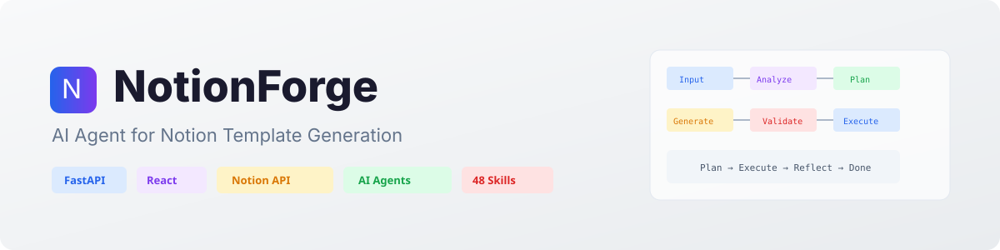

<p align="center">
  <picture>
    <source media="(prefers-color-scheme: dark)" srcset="docs/assets/banner-dark.svg">
    <source media="(prefers-color-scheme: light)" srcset="docs/assets/banner-light.svg">
    
  </picture>
</p>

# NotionForge

<p align="center">
  <a href="https://github.com/JaylenAI/Notion_Forge/actions/workflows/ci.yml"></a>
  <a href="https://github.com/JaylenAI/Notion_Forge/blob/main/LICENSE"></a>
  <a href="https://www.python.org/downloads/"></a>
  <a href="https://notion.so"></a>
  <a href="https://docs.docker.com/"></a>
</p>

<p align="center">
  <b>자연어 한 마디로 프로급 Notion 워크스페이스를 자동 생성하는 AI 에이전트.</b>
</p>

<p align="center">
  <a href="#quickstart">빠른 시작</a> &bull;
  <a href="#features">주요 기능</a> &bull;
  <a href="#architecture">아키텍처</a> &bull;
  <a href="#skills">스킬 시스템</a> &bull;
  <a href="docs/">문서</a> &bull;
  <a href="CONTRIBUTING.md">기여 가이드</a>
</p>

---

"CRM 대시보드 만들어줘" — 이 한 마디면 AI가 데이터베이스 설계, 뷰 10종 배치, Relation/Formula/Rollup 연결, 대시보드 위젯 구성, 샘플 데이터 채우기까지 전부 처리합니다. 5개 AI 프로바이더를 지원하고, Notion API 2026-03-11의 거의 모든 기능을 활용합니다.

<table>
<tr><td><b>Plan-Execute-Reflect Agent</b></td><td>AI가 도구를 직접 선택·실행·검증하는 자율 에이전트 루프. 최대 3회 Re-plan으로 최적 결과 도출.</td></tr>
<tr><td><b>11개 도구 + 48개 스킬</b></td><td>Tool Registry 기반 LLM function calling. 12개 Tier1 + 36개 Tier2 도메인 특화 스킬로 어떤 요청이든 최적 템플릿 생성.</td></tr>
<tr><td><b>5개 AI 프로바이더</b></td><td>Copilot SDK (GPT-4.1, 무료) / Claude / Gemini / Groq / OpenAI — Strategy Pattern으로 API 키만 넣으면 자동 감지.</td></tr>
<tr><td><b>뷰 10종 + 대시보드</b></td><td>Table, Board, Calendar, Timeline, Gallery, List, Chart, Form, Dashboard, Pivot — 위젯 자동 배치, 필터/정렬 바인딩.</td></tr>
<tr><td><b>Notion Workers 통합</b></td><td>Sync/Tool/Webhook TypeScript 워커 자동 생성 + 배포. External Agents API로 AI를 Notion에 네이티브 등록.</td></tr>
<tr><td><b>실시간 채팅 UI</b></td><td>React 19 + WebSocket 실시간 스트리밍. 생성 과정을 단계별로 표시. 멀티턴 대화로 수정 가능.</td></tr>
<tr><td><b>블루프린트 자동 보정</b></td><td>Gen-Eval 구조 검증 (최대 3회) + PostProcessor 13종 자동 수정. 실패 시 자동 롤백.</td></tr>
<tr><td><b>보안 내장</b></td><td>Input Guardrail (프롬프트 인젝션 방어), Rate Limiting, CSRF 방어, OAuth 연동, 에러 정제.</td></tr>
</table>

---

<h2 id="quickstart">빠른 시작</h2>

### 사전 요구사항

| 도구 | 최소 버전 | 확인 명령 |
|------|----------|----------|
| Python | 3.11+ | `python --version` |
| [uv](https://docs.astral.sh/uv/) | 최신 | `uv --version` |
| Node.js | 20+ | `node --version` |
| Docker (선택) | 24+ | `docker --version` |

### 1. 클론 & 환경 설정

```bash
git clone https://github.com/JaylenAI/Notion_Forge.git
cd Notion_Forge
cp .env.example .env
```

### 2. `.env` 설정

```env
# 필수 (2개만 설정하면 됩니다)
NOTION_API_KEY=ntn_xxxxxxxxxxxx       # https://notion.so/my-integrations
NOTION_PARENT_PAGE_ID=xxxxx           # 템플릿 생성할 부모 페이지 ID

# AI 프로바이더 — 하나만 설정하면 자동 감지 (우선순위: Copilot > Claude > Gemini > Groq)
COPILOT_ENABLED=true                  # GitHub Copilot 구독자는 API 키 불필요
ANTHROPIC_API_KEY=                    # Claude (유료, 최고 품질)
GEMINI_API_KEY=                       # Gemini (무료, 일 20회)
GROQ_API_KEY=                         # Groq (무료, 빠름)
```

### 3. 실행

**Docker (권장)**
```bash
docker compose up --build
```

**로컬 (uv + npm)**
```bash
# 터미널 1: Backend
cd backend && uv sync && uv run uvicorn app.main:app --port 9500 --reload

# 터미널 2: Frontend
cd frontend && npm install && npm run dev
```

### 4. 접속

| 서비스 | URL |
|--------|-----|
| 채팅 UI | http://localhost:9501 |
| API 문서 (Swagger) | http://localhost:9500/docs |
| Backend API | http://localhost:9500 |

---

<h2 id="features">주요 기능</h2>

### AI Agent

| 기능 | 설명 |
|------|------|
| Plan-Execute-Reflect 루프 | AI가 도구 선택 → 실행 → 검증을 자율 반복 (최대 3회 Re-plan) |
| Tool Registry 11개 | create_page, create_database, add_blocks, create_columns, add_database_items, link_databases, create_view, create_worker, register_external_agent, apply_color_theme, generate_cover |
| 하이브리드 SkillRouter | 키워드 빠른경로 (score>=2) + LLM 정밀 분류 |
| Episodic Memory | 성공/실패 패턴 학습 + 유저 선호도 기억 |
| Provider Strategy | 5개 프로바이더 자동 감지 + Fallback Chain + Circuit Breaker |
| Input Guardrail | 프롬프트 인젝션 방어 + 입력 검증 |
| Approval Gate | 생성 전 사용자 확인/취소 |

### Notion API 전체 지원 (2026-03-11)

| 영역 | 지원 범위 |
|------|----------|
| 블록 30+종 | heading, callout, toggle, quote, code, table, equation, tab, synced_block, button 등 |
| 인라인 서식 | bold, italic, underline, strikethrough, code, link, 색상, 멘션 |
| 미디어 | image, video, audio, file, pdf, bookmark, embed (Figma, GitHub, Loom 등 12개) |
| DB 뷰 10종 | table, gallery, calendar, board, timeline, list, chart, form, dashboard, pivot |
| DB 속성 전체 | select, multi_select, status, relation, rollup, formula, unique_id, people 등 |
| 고급 필터 | 상대 날짜, multi-value, "me" 필터, AND/OR 복합 조건 |
| 대시보드 | 차트/숫자/리스트/필터뷰 위젯 + 자동 배치 |
| Workers | Sync/Tool/Webhook TypeScript 워커 생성 + 배포 |
| External Agents | AI 에이전트 Notion 네이티브 등록 |
| Comments | 블록/스레드 댓글 CRUD |
| File Upload | 서버→Notion 직접 파일 업로드 |
| CLI 통합 | `ntn` CLI Python 래퍼 (api, deploy, dev, logs) |

### 프론트엔드

| 기능 | 설명 |
|------|------|
| 실시간 스트리밍 | WebSocket으로 생성 과정 단계별 표시 |
| 다크/라이트 테마 | CSS 변수 기반 전체 테마 시스템 |
| 5개 페이지 | Dashboard, Library, Integrations, Profile, Support |
| Notion 스타일 미리보기 | 14개 블록 + 4개 DB 뷰 렌더링 |
| 프롬프트 라이브러리 | 4개 카테고리 x 18개 프롬프트 템플릿 |
| 모바일 반응형 | 768px 이하 탭 전환 UI |
| 멀티턴 수정 | "속성 추가해줘", "뷰 바꿔줘" 자연어 수정 |
| 다국어 | 한국어 / 영어 / 일본어 |

---

<h2 id="architecture">아키텍처</h2>

```
User Input
  │
  ├─ [0] Input Guardrail ─── 프롬프트 인젝션 방어 + 입력 검증
  │
  ├─ [1] Intent Analyzer ─── 의도 분석 (CREATE / MODIFY / QUESTION)
  │
  ├─ [2] Skill Router ────── 48개 스킬 중 최적 매칭 (키워드 + LLM)
  │
  ├─ [3] Episodic Memory ─── 과거 성공/실패 패턴 + 유저 선호도
  │
  ├─ [4] Layout Router ───── 8개 레이아웃 패턴 자동 선택
  │
  ├─ [5] Prompt Assembler ── 모듈 .md 동적 조립 (base + mode + layout + views)
  │
  ├─ [6] AI Generation ───── Provider Strategy (Copilot/Claude/Gemini/Groq/OpenAI)
  │
  ├─ [7] Gen-Eval Loop ───── 구조적 검증 → 실패 시 AI 피드백 → 재생성 (최대 3회)
  │
  ├─ [8] Post-Processor ──── 13종 자동 보정 (callout, status, spacing, 한국어 매핑 등)
  │
  ├─ [9] Approval Gate ───── 사용자 확인/취소
  │
  ├─ [10] Agent Loop ──────── Plan-Execute-Reflect (Tool Registry 11개 도구)
  │
  ├─ [11] 5-Pass Creation ── 페이지 → 서브페이지 → DB(레거시) → 뷰(최신) → 샘플 데이터
  │
  └─ [12] Rollback ────────── 실패 시 자동 삭제
```

### 레이아웃 패턴

| 레이아웃 | 용도 | 기본 뷰 |
|---------|------|---------|
| `simple_tracker` | 습관/운동/수면 트래커 | table |
| `gallery_hero` | 일기/독서/레시피 컬렉션 | gallery |
| `kanban_board` | 프로젝트/태스크/스프린트 | board |
| `calendar_main` | 일정/콘텐츠 캘린더 | calendar |
| `dashboard_widgets` | CRM/대시보드/KPI | board + chart |
| `category_hub` | 온보딩/위키/가이드 | toggles |
| `portfolio` | 포트폴리오/이력서 | gallery + timeline |
| `sidebar_main` | 범용 (기본값) | table |

---

<h2 id="skills">스킬 시스템 (48개)</h2>

### Tier 1 — 범용 카테고리 (12개)

| 스킬 | 용도 | 기본 뷰 |
|------|------|---------|
| `track` | 습관/운동/공부 추적 | calendar, table |
| `collect` | 수집/기록 (책, 영화, 맛집) | gallery, table |
| `manage` | 프로젝트/태스크 관리 | board, timeline |
| `plan` | 계획/일정 (여행, 결혼) | calendar, table |
| `organize` | 정보 정리 (북마크, 연락처) | table, list |
| `guide` | 안내/온보딩/매뉴얼 | table, board |
| `hub` | 대시보드/팀 홈 | calendar, board |
| `finance` | 가계부/예산/투자 | table, calendar |
| `journal` | 일기/회고/감사 일지 | gallery, calendar |
| `content` | 콘텐츠 캘린더/SNS | board, calendar |
| `learn` | 학습/시험/어학 | table, board |
| `crm` | 고객 관리/영업 | board, timeline |

### Tier 2 — 도메인 특화 (36개)

| 카테고리 | 스킬 | 용도 |
|---------|------|------|
| track | fitness, habit, health, diet | 운동/습관/건강/식단 |
| collect | reading, recipe, movie, music, cafe | 독서/레시피/영화/음악/카페 |
| manage | project, sprint, bug, meeting | 프로젝트/스프린트/버그/회의록 |
| plan | travel, wedding, goals | 여행/결혼/목표(OKR) |
| organize | bookmark, inventory, contact | 북마크/재고/연락처 |
| guide | onboarding, wiki, sop | 온보딩/위키/SOP |
| hub | team_home, life_os | 팀 홈/라이프 OS |
| finance | budget, investment, subscription | 가계부/투자/구독관리 |
| journal | diary, gratitude, review | 일기/감사일지/회고 |
| content | blog, youtube, social | 블로그/유튜브/SNS |
| learn | study, language | 공부/어학 |
| crm | sales | 영업 파이프라인 |

> 새 스킬 추가는 `app/skills/` 아래에 디렉토리 + `SKILL.md` 패턴 파일만 작성하면 됩니다.  
> 자세한 가이드: [docs/SKILL_GUIDE.md](docs/SKILL_GUIDE.md)

---

## 기술 스택

| 레이어 | 기술 |
|--------|------|
| **Backend** | Python 3.11+ / FastAPI / uv |
| **AI** | Copilot SDK (GPT-4.1) / Claude / Gemini / Groq / OpenAI — Strategy Pattern |
| **Notion** | notion-client 2.x + httpx (듀얼 API: 쓰기 2022-06-28 / 읽기·뷰 2026-03-11) |
| **Frontend** | React 19 / TypeScript 5.7 / Vite 7 / Zustand 5 / TailwindCSS 4 |
| **테스트** | pytest (1,320개 테스트, 80%+ 커버리지) |
| **CI/CD** | GitHub Actions (lint → test → typecheck → docker → security scan) |
| **배포** | Docker Compose (Multi-stage build) |

---

## 프로젝트 구조

```
NotionForge/
├── backend/
│   ├── app/
│   │   ├── main.py                   # FastAPI 진입점
│   │   ├── config.py                 # 프로바이더 자동 선택
│   │   ├── agent/                    # AI Agent 핵심
│   │   │   ├── orchestrator.py       # 실시간 스트리밍 파이프라인
│   │   │   ├── agent_loop.py         # Plan-Execute-Reflect
│   │   │   ├── creation_executor.py  # 5-Pass Notion 생성
│   │   │   ├── providers/            # LLM Provider Strategy (5종)
│   │   │   ├── tools/                # Tool Registry (11개 도구)
│   │   │   └── prompts/              # 모듈화 프롬프트 (.md)
│   │   ├── skills/                   # 48개 도메인 스킬
│   │   ├── notion/                   # Notion API 클라이언트 (Mixin 패턴)
│   │   │   ├── client.py             # NotionClient (통합)
│   │   │   ├── page_ops.py           # 페이지 CRUD
│   │   │   ├── database_ops.py       # 데이터베이스 CRUD + 고급 필터
│   │   │   ├── block_ops.py          # 블록 CRUD
│   │   │   ├── view_ops.py           # 뷰 10종 + 대시보드/폼
│   │   │   ├── workers.py            # Workers API + External Agents
│   │   │   ├── worker_builder.py     # TypeScript 워커 scaffold
│   │   │   ├── filter_builder.py     # 고급 필터 빌더
│   │   │   ├── widget_builder.py     # 대시보드 위젯 빌더
│   │   │   └── cli.py                # Notion CLI 래퍼
│   │   ├── routers/                  # FastAPI 라우터 (7개)
│   │   ├── core/                     # 미들웨어, 로깅, 메트릭스
│   │   └── schemas/                  # Pydantic 모델
│   └── tests/                        # 1,320개 테스트
│       └── unit/                     # 단위 테스트 (51개 파일)
├── frontend/
│   └── src/
│       ├── components/               # React 컴포넌트
│       ├── stores/                   # Zustand 상태관리
│       ├── hooks/                    # 커스텀 훅
│       └── types/                    # TypeScript 타입
├── docs/                             # 문서
│   ├── ARCHITECTURE.md               # 시스템 설계
│   ├── API.md                        # REST/WebSocket API 명세
│   ├── CHANGELOG.md                  # 변경 이력
│   ├── SKILL_GUIDE.md                # 스킬 작성 가이드
│   └── ...
├── .github/
│   ├── workflows/ci.yml              # CI 파이프라인
│   └── ISSUE_TEMPLATE/               # 이슈 템플릿
├── docker-compose.yml                # 배포 설정
├── .env.example                      # 환경변수 템플릿
├── CONTRIBUTING.md                   # 기여 가이드
├── SECURITY.md                       # 보안 정책
└── LICENSE                           # MIT
```

---

## 비용

| 항목 | 비용 |
|------|------|
| Notion API | 무료 |
| Copilot SDK (GPT-4.1, 기본) | 무료 (GitHub Copilot 구독 필요) |
| Gemini API | 무료 (일 20회) |
| Groq API | 무료 |
| Docker / uv / Vite | 무료 |
| **합계** | **$0** (Copilot 구독 시) |

---

## 문서

| 문서 | 설명 |
|------|------|
| [아키텍처](docs/ARCHITECTURE.md) | 시스템 설계 + Mermaid 다이어그램 |
| [API 명세](docs/API.md) | REST / WebSocket 엔드포인트 |
| [변경 이력](docs/CHANGELOG.md) | 버전별 변경사항 |
| [스킬 가이드](docs/SKILL_GUIDE.md) | 커스텀 스킬 작성 가이드 |
| [블록 지원](docs/BLOCK_SUPPORT.md) | 블록/속성 지원 상태 |
| [배포 가이드](docs/DEPLOYMENT.md) | Docker / 프로덕션 배포 |
| [진행 현황](docs/CURRENT_STATUS.md) | 모듈별 진행률 |
| [로드맵](docs/ROADMAP.md) | 향후 개발 방향 |

---

## 기여

기여를 환영합니다! 자세한 내용은 [CONTRIBUTING.md](CONTRIBUTING.md)를 참고하세요.

```bash
# 개발 환경 셋업
git clone https://github.com/JaylenAI/Notion_Forge.git
cd Notion_Forge

# Backend
cd backend && uv sync
uv run pytest tests/ -v          # 테스트
uv run ruff check . && uv run ruff format .  # lint + format

# Frontend
cd ../frontend && npm install
npm run dev
```

### 확장 포인트

| 확장 | 방법 |
|------|------|
| 새 AI 프로바이더 | `app/agent/providers/`에 `BaseProvider` 구현 → `router.py`에 등록 |
| 새 도구 (Tool) | `app/agent/tools/`에 `BaseTool` 구현 → `registry.py`에 등록 |
| 새 스킬 | `app/skills/`에 디렉토리 + `SKILL.md` 패턴 파일 |
| 새 블록 타입 | `app/notion/block_builder.py`에 빌더 함수 추가 |
| 새 뷰 타입 | `app/notion/view_ops.py`에 뷰 생성 메서드 추가 |

---

## 라이선스

MIT License &mdash; [LICENSE](LICENSE) 참고.

---

<p align="center">
  <sub>Built with FastAPI, React, and the Notion API</sub>
</p>
